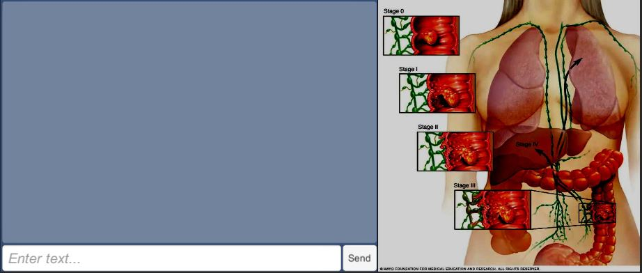

# GI Cancers 2D Gallery

GI Cancers 2D Gallery is the integration between Unity and one or more Rasa Unity Chatbots. Unity acts as a client connecting to a Rasa server deployed in a Docker container.

## TODOs:

- [ ] Ability to **understand 20 user utterances/queries** (including reasonable variations of those queries).
- [ ] Ability to have at least 2 multi-turn conversations where the user may ask follow-up questions once the bot responds to their original query.
- [ ] Ability to collect data from the user, e.g., on what date did the issue occur, how many items did you have in your order, etc.
- [ ] Ability to engage in some amount of small talk (e.g., hi, how are you, etc.)
- [ ] Ability to use a database to store information obtained from the user
- [ ] Ability to make **2 API calls to retrieve information from an external source**. (At least one of these APIs must be outside of what is built into Rasa i.e time/weather)
Needs to be deployed on Slack (see below).

## Part 1: Colon Cancer Rasa Chatbot

When you hit play in Unity, you are taken to the Colon Cancer Rasa Chatbot view:

### Way to Update Rasa

Order Rasa goes for Files to Answer User comment/question/etc:

- Rasa: nlu.yml --> stories.yml --> domain.yml

1\. I will start by greeting Rasa: **`hi`**. Then that example greet will be linked to **intent: `greet`**. Reference **`nlu.yml`**

- Me: `hi`
- Rasa: for `hi` example --> **`nlu.yml`** --> `intent: greet`

2\. Rasa goes to **`stories.yml`** for intents and actions to know how to respond to **intent: `greet`** with an **action: `utter_greet`**.

- Rasa: for `nlu.yml`'s `intent: greet` example -->  `stories.yml` --> `action: utter_greet`

3\. Rasa goes to **`domain.yml`** to know which action to say for **utter_greet**, which Rasa finds to say **text: `"Hey! How are you?"`**. We see that back in our chat window.

- Rasa: goes to `domain.yml` for response to `utter_greet` --> `text: "Hey! How are you?"`

## Appendix: Building a RASA Assistant in Docker

### Pull Rasa Docker Image

~~~bash
docker pull rasa/rasa:3.1.0-full
~~~

### Setup RASA Project

~~~bash
# Setup RASA GPU Project
docker run --name rasa-init --gpus all -it --privileged -v C:\Users\james\Documents\GitHub\GI-Cancers-2D-Gallery\rasa_apps\colon_cancer_va:/app rasa/rasa:3.1.0-full init --no-prompt
~~~

### Train RASA Model

~~~bash
# Train Rasa Model
docker run --name rasa-train --gpus all -it --privileged -v C:\Users\james\Documents\GitHub\GI-Cancers-2D-Gallery\rasa_apps\colon_cancer_va:/app rasa/rasa:3.1.0-full train --domain domain.yml --data data --out models
~~~

### Talk to your Virtual Assistant From Shell

~~~bash
# Talk to your Virtual Assistant From Shell
docker run --name rasa-shell --gpus all -it --privileged -p 5005:5005 -v C:\Users\james\Documents\GitHub\GI-Cancers-2D-Gallery\rasa_apps\colon_cancer_va:/app rasa/rasa:3.1.0-full shell
~~~

### Talk to your Virtual Assistant From Unity

To launch Rasa server, so our Virtual Assistant is just running in the Docker container, you do docker run followed by Rasa **run** command, so then external clients like Unity in our case can interact with our Virtual Assistant.

~~~bash
# Talk to your Virtual Assistant from Unity
docker run --name rasa-run --gpus all -it --privileged -p 5005:5005 -v C:\Users\james\Documents\GitHub\GI-Cancers-2D-Gallery\rasa_apps\colon_cancer_va:/app rasa/rasa:3.1.0-full run
~~~

### Adding Custom Actions

1\. Build a custom action using Rasa SDK by editing **`actions/actions.py`**:

~~~python
import requests
import json
from rasa_sdk import Action

class ActionJoke(Action):
    def name(self):
        return "action_joke"

    def run(self, dispatcher, tracker, domain):
        request = requests.get("http://api.icndb.com/jokes/random").json() # make an api call
        joke = request["value"]["joke"] # extract a joke from returned json response
        dispatcher.utter_message(text=joke) # send the message back to the user
        return []

~~~

1\. In **`data/stories.yml`**, replace **`utter_cheer_up`** with the custom action **`action_joke`** tell your bot to use this new action:

2\. In **`domain.yml`**, add a section for custom actions, including your
new action

~~~yml
actions:
  - action_joke
~~~

3\. After updating your domain and stories, you must retrain your model

~~~bash
docker run --name rasa-train --gpus all -it --privileged -v C:\Users\james\Documents\GitHub\GI-Cancers-2D-Gallery\rasa_apps\colon_cancer_va:/app rasa/rasa:3.1.0-full train --domain domain.yml --data data --out models
~~~

Your custom actions will run on a separate server from your Rasa server.

5\. Create a network to connect the two containers: docker network create my-project

~~~bash
# Test
docker network create my-project

# MVP Project
docker network create colon-cancer-mayoclinic
~~~

6\. Run the custom actions with the following command: 

~~~bash
# Test
docker run -d --name rasa-action-server --gpus all -it --privileged -p 5055:5055 -v C:\Users\james\Documents\GitHub\GI-Cancers-2D-Gallery\rasa_apps\colon_cancer_va\actions:/app/actions --net my-project rasa/rasa-sdk:3.1.1

# MVP Project
docker run -d --name cc-action-server --gpus all -it --privileged -p 5055:5055 -v C:\Users\james\Documents\GitHub\GI-Cancers-2D-Gallery\rasa_apps\colon_cancer_va\actions:/app/actions --net colon-cancer-mayoclinic rasa/rasa-sdk:3.1.1
~~~

- **`d`**: Runs container in detached mode, so you can run the Rasa container in same window
- **`v $(pwd):/app`**: Mounts your project directory into Docker container, so that action server can run the code in **`actions`** folder
- **`net my-project`**: Run server on a specific network, so Rasa container can find it 
- **`--name rasa-action-server`**: Gives server a specific name for Rasa server to reference
- **rasa/rasa-sdk:3.1.1**: Uses Rasa SDK image with tag 3.1.1
  
Run **`docker stop rasa-action-server`**. Run **`docker ps`** to see all currently running containers

7\. To instruct Rasa server to use action server, tell Rasa its location by adding this endpoint to your **`endpoints.yml`** and referencing the **`--name`** you gave the server (in our example above **`rasa-action-server`**):

~~~yml
action_endpoint:
    url: "http://rasa-action-server:5055/webhook"
~~~

8\. Now we can talk to our Rasa Chatbot via shell or from our Unity Client

~~~bash
# Test: Talk to your Virtual Assistant From Shell
docker run --name rasa-shell --gpus all -it --privileged -p 5005:5005 -v C:\Users\james\Documents\GitHub\GI-Cancers-2D-Gallery\rasa_apps\colon_cancer_va:/app --net my-project rasa/rasa:3.1.0-full shell
~~~

Talk to our Rasa Chatbot from Unity:

~~~bash
# Test: Talk to your Virtual Assistant from Unity
docker run --name rasa-run --gpus all -it --privileged -p 5005:5005 -v C:\Users\james\Documents\GitHub\GI-Cancers-2D-Gallery\rasa_apps\colon_cancer_va:/app --net my-project  rasa/rasa:3.1.0-full run
~~~
