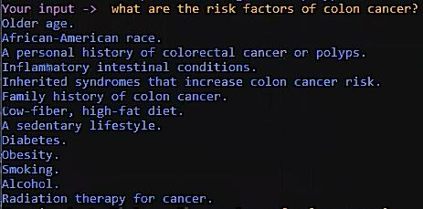
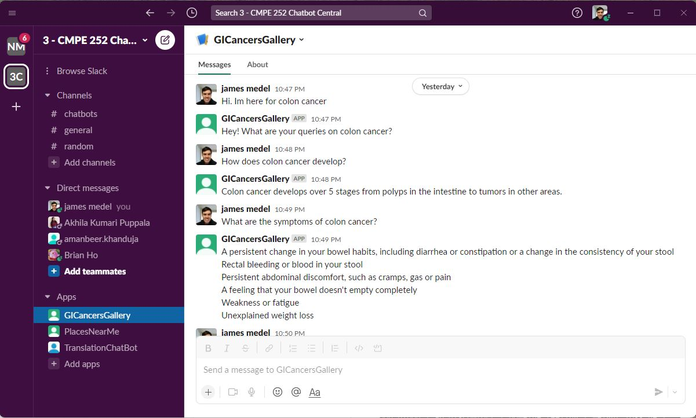
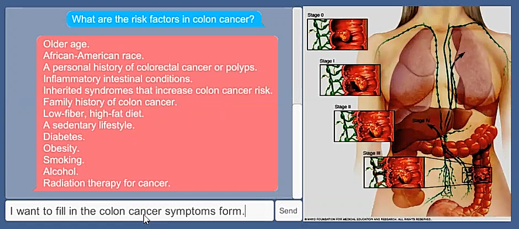

# GI Cancers 2D Gallery Rasa VA

## Overview

GI Cancers 2D Gallery originally was inspired by museums that feature virtual tours where you can have a conversations with a chatbot. But GI Cancers 2D Gallery would feature one or more types of GI Cancer with the stages of that cancer in a portrait and deployed on the backend of that portrait would be a Rasa chatbot that is knowledgeable in that cancer area.

As the requirements for the project changed for CMPE 252 and we were required to integrate our Rasa Chatbot with Slack, I stopped working on the Unity portion, so I could make sure Slack integration worked.

So what will be featured on this page is how to setup the development environment with Docker containers. Then we will walk through how to connect our Rasa Chatbot to our Slack Channel workspace. Finally, we will go through some example statements and queries we can send Rasa, so we can get the conversation going about Colon Cancer.

Here is a link to the demo of me setting up the Software Development Environment for GI Cancers Rasa project:

- [YouTube: Setup Software Dev Env for Colon Cancer Rasa Project | SJSU CMPE 252 AI Demo](https://www.youtube.com/watch?v=lfyNEu5teZw)

Here is a link to the demo of me interacting with Rasa from Shell:

- [YouTube: Colon Cancer Consultation with Rasa Shell VA | SJSU CMPE 252 AI Demo](https://www.youtube.com/watch?v=A-pmkEfo9Ps)

**Figure 1:** Rasa Shell App Deployment Example

Here is a link to the demo of me interacting with Rasa from Slack:

- [YouTube: Colon Cancer Consultation with Slack Rasa VA | SJSU CMPE 252 AI Demo](https://www.youtube.com/watch?v=5VjcWlqOXgU)

**Figure 2:** Rasa Slack App Deployment Example

Here is a link to the demo of me interacting with Rasa from Unity:

- [YouTube: Colon Cancer Consultation with Unity Rasa VA | SJSU CMPE 252 AI Demo](https://www.youtube.com/watch?v=hQWY9gjZ7WU)

**Figure 3:** Rasa Unity App Deployment Example

## Outline

- [GI Cancers 2D Gallery Rasa VA](#gi-cancers-2d-gallery-rasa-va)
  - [Overview](#overview)
  - [Outline](#outline)
  - [Contents](#contents)
  - [Chatbot Functionality](#chatbot-functionality)
  - [Deliverablees](#deliverablees)
  - [Setup Software Dev Environment for Project](#setup-software-dev-environment-for-project)
    - [Software Dependencies for Running Demo](#software-dependencies-for-running-demo)
  - [Launch Docker SpringBoot and MySQL Before Running Rasa](#launch-docker-springboot-and-mysql-before-running-rasa)
  - [Build Rasa & Rasa SDK Docker Image](#build-rasa--rasa-sdk-docker-image)
  - [How to Run Rasa Demo](#how-to-run-rasa-demo)
    - [Approach 1: Talk to Rasa VA from Shell](#approach-1-talk-to-rasa-va-from-shell)
    - [Approach 2: Talk to Rasa VA from Slack](#approach-2-talk-to-rasa-va-from-slack)
    - [No requests to display yet](#no-requests-to-display-yet)
  - [Appendix](#appendix)
    - [Understanding Rasa Conversation Flow](#understanding-rasa-conversation-flow)
    - [Rasa Custom Actions Leverage: Scrapy](#rasa-custom-actions-leverage-scrapy)
  - [References](#references)

## Contents

- **[docs](./docs/)**: contains documentation on the project
- **[gi-cancers-api](./gi-cancers-api/)**: contains Java Spring Boot server code for connecting Rasa's temporary data collected on the patient to MySQL
- **[gi-cancers-mysql-db](./gi-cancers-mysql-db/)**: contains schema.sql file for creating the tables that could contain healthcare data from data collected in colon cancer consultations between the patient and doctor. Currently just one table we populate with patient colon cancer symptoms **pcc_symptoms** table. You will see other tables there too, but they aren't being used.
- **[images](./images)**: contains images that are used in this README and the docs files.
- **[rasa_apps](./rasa_apps/)**: contains one rasa chatbot app, which is focused on **colon cancer** virtual assistance. The idea here was that I could have multiple rasa chatbots that are each trained on different NLU data based on a particular GI cancer conversation flow. There is also a Rasa Dockerfile too.
- **[Rasa-Unity-2D-Gallery](./Rasa-Unity-2D-Gallery/)**: contains Unity 2D assets and C# code for integrating my Rasa chatbot Python app into a Unity 2D scene. To build this part of the app, I referenced this tutorial "[Integrating Rasa Open Source Chatbot Into Unity [Part 1] : The Connection](https://medium.com/analytics-vidhya/integrating-rasa-open-source-chatbot-into-unity-part-1-the-connection-9ba582c804cd)" and this one "[Integrating Rasa Open Source Chatbot Into Unity [Part 2] : The Visuals](https://medium.com/analytics-vidhya/integrating-rasa-open-source-chatbot-into-unity-part-2-the-visuals-f67a915a4b2d)".
- **README**: explains project overview, contents, steps on how to run the demo

## Chatbot Functionality

- [x] Ability to **understand 20 user utterances/queries** (including reasonable variations of those queries).
- [ ] Ability to have at least 2 multi-turn conversations where the user may ask follow-up questions once the bot responds to their original query.
- [x] Ability to collect data from the user, e.g., on what date did the issue occur, how many items did you have in your order, etc.
- [x] Ability to engage in some amount of small talk (e.g., hi, how are you, etc.)
- [x] Ability to use a **database to store information obtained from the user**
    - [x] Creating Tables in MySQL Docker Container for Database on Colon Cancer user symptoms, risk factors, etc
    - [x] Need to create SpringBoot Docker container middleware layer for passing data between Rasa chatbot and MySQL database

- [x] Ability to make **2 API calls to retrieve information from an external source**. (At least one of these APIs must be outside of what is built into Rasa i.e time/weather)
    - [x] Make API Call to Fetch Colon Cancer Symptoms
    - [x] Make API Call to Fetch Colon Cancer Risk Factors
- [x] Needs to be deployed on Slack (see below).

## Deliverablees

- [x] Presentation in class
    - Must cover the following for your chatbot:
      - [x] Motivation for your choice of use case
      - [x] Conversation flows you implemented + Demo
      - [x] Challenges you encountered
      - [x] Insights/lessons learned   
- [x] Submission of project collatoral on SJSU Canvas
    - [x] Link to code on GitHub + instructions on running it
    - [x] Create a private GitHub repository (not public) and share access with both Amanbeer and Prof. Jetcheva
    - [x] Mention in your README file what version of Rasa the chatbot has been developed on
    - [x] The repository must contain a '[requirements.txt](./rasa_apps/RasaDockerfile/requirements.txt)' file with all the dependencies required to run the chatbot (you can make one with `pip freeze` command). As an alternative to the **requirements.txt** file, I use a **[Dockerfile](./rasa_apps/RasaDockerfile/Dockerfile)** that has all the dependencies required to run my Rasa chatbot in a Docker container. But I have added a requirements.txt file based on the conda environment running inside that Docker container.
    - [x] Mention any open issues that you found to exist in your chatbot

## Setup Software Dev Environment for Project

In case you run into any issues, here is a link to the demo of me setting up the Software Development Environment for GI Cancers Rasa project:

- [YouTube: Setup Software Dev Env for Colon Cancer Rasa Project | SJSU CMPE 252 AI Demo](https://www.youtube.com/watch?v=lfyNEu5teZw)

### Software Dependencies for Running Demo

The following software can be installed in Anaconda or Docker:

- Rasa 3.1.0 (Rasa Chatbot Server)
- Rasa 3.1.1 SDK (Rasa Actions Server)
- Scrapy Web Crawler
- Java Spring Boot 2.6.6
- MySQL 8.0.27
- Ngrok version latest

My **Docker Desktop version was 4.3.2** when I installed the software above. We will install [Docker Desktop](https://www.docker.com/products/docker-desktop/) to deploy our Rasa app across Docker containers.

1\. Open your terminal and clone this project repository

~~~batch
git clone https://github.com/james94/GI-Cancers-2D-Gallery
~~~

2\. Go to the Rasa GI Cancers project:

~~~batch
rem change "path\to" with your path to the project
cd path\to\GI-Cancers-2D-Gallery
~~~

## Launch Docker SpringBoot and MySQL Before Running Rasa

Refer to guide [Deploy MySQL and SpringBoot Containers for GiCancers App](./docs/DockerMySQLBackend.md) that goes through the necessary steps.

After following that guide, you will have a Java Spring Boot Docker container and a MySQL Docker container running.

## Build Rasa & Rasa SDK Docker Image

1\. Open your terminal or command prompt, let's go to the Rasa Dockerfile and build it:

~~~batch
cd GI-Cancers-2D-Gallery\rasa_apps\RasaDockerfile
docker build -t rasa_3.1.0_rasa_sdk_3.1.1:dev .
~~~

You should get a Docker image with Rasa and Rasa SDK installed and other dependencies.

## How to Run Rasa Demo

1\. First we'll go to the Rasa project folder:

~~~batch
cd GI-Cancers-2D-Gallery\rasa_apps\colon_cancer_va
~~~

2\. If you dont have the following docker network, we will create a docker network **colon-cancer-mayoclinic** for our Rasa Actions Server container to run in:

~~~bash
docker network create colon-cancer-mayoclinic
~~~

3\. Deploy a Docker container where we will run Rasa Actions Server:

~~~batch
rem Launch the Docker container named rasa-action-server
docker run -d --name rasa-action-server -it --privileged -p 5055:5055 -v C:\Users\james\Documents\GitHub\GI-Cancers-2D-Gallery\rasa_apps\colon_cancer_va:/app --net colon-cancer-mayoclinic rasa_3.1.0_rasa_sdk_3.1.1:dev

rem Once the container is launched, lets jump into it to run actions server
docker exec -it rasa-action-server /bin/bash
cd /app
rasa run actions
~~~

Note: rasa **[endpoints.yml](./rasa_apps/colon_cancer_va/endpoints.yml)** will be impacted if you choose to run rasa actions server locally or in docker. For this tutorial, I will leave **endpoints.yml** as it was for docker container approach, so the **url** will contain **rasa-action-server** instead of local machine **<localhost>**.

There are 3 approaches that we can use to talk to our Rasa Virtual Assistant: Slack, Shell or Unity. We will focus on the first two approaches: **Slack and Shell**.

### Approach 1: Talk to Rasa VA from Shell

Talking to Rasa from shell is probably the fastest approach.

1\. Since our rasa actions server is running in our Docker container, open a new terminal, we'll launch another Docker container **rasa-shell** for interacting with Rasa Chatbot:

~~~batch
cd GI-Cancers-2D-Gallery\rasa_apps\colon_cancer_va

rem Launch the Docker container named rasa-shell
docker run --name rasa-shell -it --privileged -p 5005:5005 -v C:\Users\james\Documents\GitHub\GI-Cancers-2D-Gallery\rasa_apps\colon_cancer_va:/app --net colon-cancer-mayoclinic rasa_3.1.0_rasa_sdk_3.1.1:dev

rem Once the container is launched, you'll auto jump into it, then exec rasa run server
cd /app
rasa shell
~~~

Example Statements you as the patient can send to Rasa:

- `"Im visiting about colon cancer"`
- `"What are the phases of colon cancer?"`
- `"What are the signs of colon cancer?"`
- `"What are colon cancer risk factors?"`
- `"I want to fill in the colon cancer symptoms form."`

Here is a link to the demo of me interacting with Rasa from Shell:

- [YouTube: Colon Cancer Consultation with Rasa Shell VA | SJSU CMPE 252 AI Demo](https://www.youtube.com/watch?v=A-pmkEfo9Ps)

### Approach 2: Talk to Rasa VA from Slack

If you have not setup your own Slack App using Slack's API that Rasa can connect to, follow Rasa's guide **[Rasa - Slack](https://rasa.com/docs/rasa/connectors/slack/)**. Then lets update our **[credentials.yml](./rasa_apps/colon_cancer_va/credentials.yml)** file.

1\. You will need to update the following key value pairs:

~~~yml
slack:
 slack_token: <your_token>
 slack_channel: <your_channel_id>
 slack_signaling_secret: <your_secret_token>
~~~

Once you have updated those slack related credentials, we can launch rasa run server, so we can talk to our chatbot from Slack.

2\. Launch Rasa run server Docker container:

~~~batch
cd GI-Cancers-2D-Gallery\rasa_apps\colon_cancer_va

rem Launch the Docker container named rasa-run
docker run --name rasa-run -it --privileged -p 5005:5005 -v C:\Users\james\Documents\GitHub\GI-Cancers-2D-Gallery\rasa_apps\colon_cancer_va:/app --net colon-cancer-mayoclinic rasa_3.1.0_rasa_sdk_3.1.1:dev

rem Once the container is launched, lets jump into it to exec rasa run server
cd /app
rasa run
~~~

3\. Once the rasa run server is running on port 5005, we should open a new terminal and launch ngrok Docker container to expose our Rasa app to the internet, so its easier for slack to connect to it:

~~~batch
docker run -d -p 4040:4040 --privileged --net colon-cancer-mayoclinic --name ngrok-integ-rasa wernight/ngrok ngrok http rasa-run:5005
~~~

The following public urls are examples of what you see going to **http://localhost:4040/inspect/http**:

~~~md
### No requests to display yet

To get started, make a request to one of your tunnel URLs:

http://30d7-71-202-240-74.ngrok.io
https://30d7-71-202-240-74.ngrok.io
~~~

4\. Now you'll want to go to your **Slack API Event Subscriptions**, under Enable Events, provide it with the url of where it can connect with your Rasa app through the url ngrok created:

~~~batch
rem Example of web url, change ngrok hostname "72f8-104-58-202-197.ngrok.io"
http://30d7-71-202-240-74.ngrok.io/webhooks/slack/webhook
~~~

If Slack API can connect to Rasa, you should get a verified check mark. 

**Troubleshooting**: If you run into issues where slack cant connect to Rasa, make sure "rasa run server" is running in one conda prompt and that the ngrok is running in another conda prompt. If you are running it at a public network, work network, you can try at your home network to see if there is a difference.

5\. Go to your Slack App where you will be interacting with Rasa. Here are some example statements you as the patient can send to Rasa:

- `"Im visiting about colon cancer"`
- `"What are the phases of colon cancer?"`
- `"What are the signs of colon cancer?"`
- `"What are colon cancer risk factors?"`
- `"I want to fill in the colon cancer symptoms form."`

Here is a link to the demo of me interacting with Rasa from Slack:

- [YouTube: Colon Cancer Consultation with Slack Rasa VA | SJSU CMPE 252 AI Demo](https://www.youtube.com/watch?v=5VjcWlqOXgU)

## Appendix 

### Understanding Rasa Conversation Flow

For referencing Rasa conversation flow, check out this doc: [UnderstandingRasaFlow.md](./docs/UnderstandingRasaFlow.md)

<!-- ### Building a RASA Assistant in Docker

For referencing steps on building the Rasa Assistant in Docker, check out this doc: [Building a RASA Assistant in Docker](./docs/BuildingRasaAssistantDocker.md) -->

### Rasa Custom Actions Leverage: Scrapy

For referencing Scrapy Web Crawler examples toward Mayo Clinic, check out this doc: [Scrapy Web Crawler Examples Scraping Mayo Clinic](./docs/ScrapyWebCrawlerExamples.md)

## References

- [MayoClinic: Colon Cancer](https://www.mayoclinic.org/diseases-conditions/colon-cancer/symptoms-causes/syc-20353669)

- [MayoClinic API](https://gbs.mayoclinic.org/licensable-content/content-platform.php)

- [Storing data to the Database | Rasa Chatbot | Part - 1](https://www.youtube.com/watch?v=rS4Wb8hvggI)

- [Storing data to the Database | Rasa Chatbot | Part - 2](https://www.youtube.com/watch?v=Ds8cB3LZwfU)

- [fediazgon/mayoclinic-scrapper]()

- [ReactorNotRestartable error in while loop with scrapy](https://stackoverflow.com/questions/39946632/reactornotrestartable-error-in-while-loop-with-scrapy): solution to allowing me to run my scrapy spider web crawler in my Actions run method multiple times.

- [Expose Docker Container services on the Internet using the ngrok docker image](https://medium.com/oracledevs/expose-docker-container-services-on-the-internet-using-the-ngrok-docker-image-3f1ea0f9c47a)

- [Change in Bowel Habits - Healthline](https://www.healthline.com/health/change-in-bowel-habits)

- [Abdominal Pain - Cleveland Clinic](https://my.clevelandclinic.org/health/symptoms/4167-abdominal-pain)
